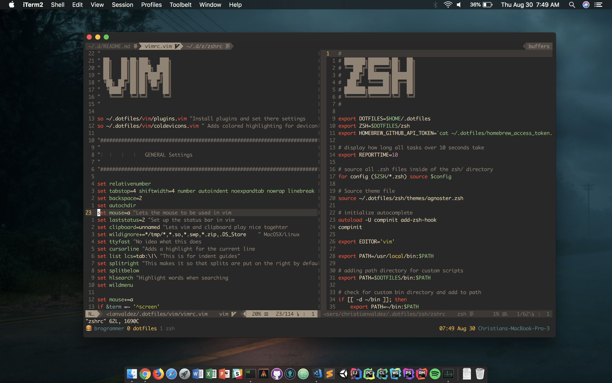

# My Dotfiles

These are the config files for zsh, tmux, hyperterm, intellij, clion, ctags, and
everything else I need to be productive on my computer.

## Homebrew I work mainly on macOS, thus I use homebrew as my package manager.
To install run the command `/usr/bin/ruby -e "$(curl -fsSL
https://raw.githubusercontent.com/Homebrew/install/master/install)"` in the
terminal and you're all good to go!

## Zsh I use zsh as my main shell. To set up, use the command `chsh -s /bin/zsh`
to make zsh your default shell. Then run the command `ln -s
dotfiles/zsh/zshrc.symlink ~/.zshrc` to make a soft link.

## Tmux Tmux is a great tool if like to have multiple terminal windows open at
once at get nothing accomplished.

## Vim & Neovim I use both Vim and Neovim depending on my needs. Vim for any
kind of language, and Neovim tweaked specifically for C/C++ and Javascript.

## Screenshot of how it all looks

